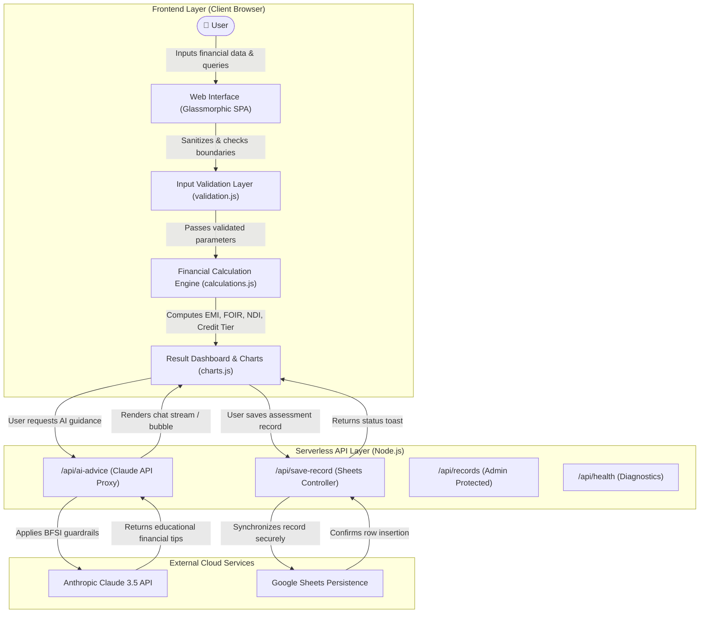

# System Workflow & Data Flow Architecture

This document maps the end-to-end data lifecycle of the **AI Loan Eligibility Checker** platform across user interface components, validation rules, financial computation engines, serverless API routes, external AI intelligence, and persistence mechanisms.

---

## 1. High-Level Workflow Diagram

---

## 2. Sequence Flow

### A. Loan Eligibility Assessment
1. **User Input:** User specifies income, obligations, credit score, desired loan, tenure, and living expenses.
2. **Validation:** Client-side validator checks data types, positive boundaries, adult age thresholds, and cross-field logic (e.g. existing EMI cannot exceed income).
3. **Execution:** `FinancialEngine.evaluateLoanEligibility`:
   - Determines benchmark interest rate from credit score.
   - Calculates Fixed Obligation to Income Ratio (FOIR).
   - Calculates Net Disposable Income (NDI).
   - Calculates maximum permissible EMI capacity.
   - Reverses present value to estimate maximum loan eligibility amount.
   - Categorizes status into **Likely Eligible**, **Review Required**, or **Lower Eligibility**.
4. **Rendering:** Real-time updates to status badge, indicative borrowing ceiling, DTI metric, and contributing factor tags.

### B. AI Advisory Guidance
1. **Trigger:** User asks a financial query or clicks a prompt chip (e.g., *"How can I improve my loan eligibility?"*).
2. **Context Enrichment:** The frontend bundles current loan or credit parameters into a sanitized JSON context.
3. **Serverless Dispatch:** `POST /api/ai-advice` receives request and strips malicious characters.
4. **Guardrail Enforcement:** The proxy injects strict BFSI system instructions (educational only, no false promises, non-fiduciary).
5. **Claude API Call:** Invokes `https://api.anthropic.com/v1/messages` using `process.env.ANTHROPIC_API_KEY`.
6. **Graceful Fallback:** If credentials are pending configuration, high-quality rule-guided educational responses are returned without runtime errors.
7. **Client Render:** Typing indicator terminates, and formatted markdown response is rendered with retry capabilities.

### C. Google Sheets Storage
1. **Dispatch:** `POST /api/save-record` transmits sanitized assessment snapshot.
2. **Security Check:** Zero credentials exposed in frontend; backend reads `GOOGLE_SHEETS_WEBHOOK_URL` or Service Account credentials.
3. **Persistence:** Appends timestamped row to spreadsheet or buffers in local memory session.
